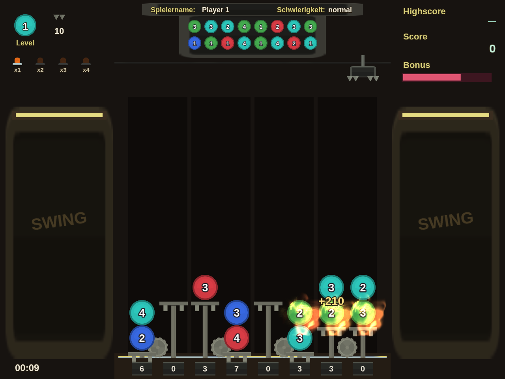
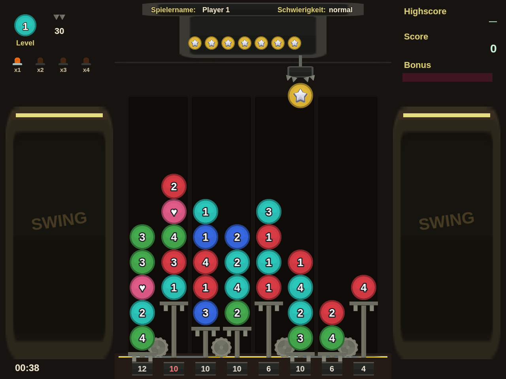
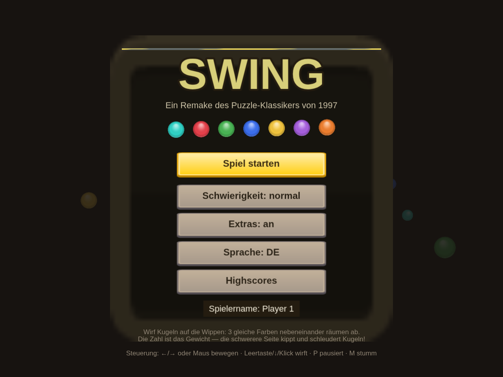

# swing.js

A browser remake of **Swing** (1997, Software 2000 — released in the US as *Marble Master*),
the nearly forgotten German seesaw puzzle game. Built with [Phaser 3](https://phaser.io)
and [Kenney.nl](https://kenney.nl) CC0 assets.

*Ein Browser-Remake des fast vergessenen Puzzlespiels **Swing** (1997, Software 2000).
Die Oberfläche ist auf Deutsch und Englisch umschaltbar.*



<details>
<summary>More screenshots / Mehr Screenshots</summary>




</details>

## Play / Spielen

Any static file server works. Two options are built in:

```bash
npm run serve          # http-server via npx, port 8080
# or, without npm at all:
node e2e/serve.js 8080
```

Then open <http://localhost:8080>. (ES modules require http — opening `index.html`
directly from `file://` will not work.)

### GitHub Pages

The repo ships a workflow (`.github/workflows/deploy-pages.yml`) that runs the unit
tests and deploys the game on every push to `main`. One-time setup: repo
**Settings → Pages → Source: "GitHub Actions"** (the workflow also tries to enable
this automatically on its first run). The game then lives at
`https://<user>.github.io/swing.js/`.

### Controls / Steuerung

| Action | Desktop | Touch |
|---|---|---|
| Aim claw / Greifarm zielen | `←` `→` or hover | tap a column (or drag) |
| Drop ball / Kugel abwerfen | `Space`, `↓` or click | tap the aimed column again |
| Pause | `P` or `Esc` | ⏸ button |
| Mute / Stumm | `M` | 🔊 button |

**Mobile:** plays best in landscape. The page is installable — "Add to Home
Screen" on iOS gives you a fullscreen standalone app with its own icon. Name
entry uses a native input, so the on-screen keyboard just works.

### URL parameters (for testing)

`?seed=42` reproducible game · `?autostart=1` skip the menu · `?difficulty=easy|normal|hard` ·
`?lang=de|en` · `?mute=1` · `?extras=0` disable special balls

## The rules / Die Regeln

- The playfield is 4 **seesaws** (8 columns). Each ball has a **weight** (the number
  on it). A seesaw tips toward the heavier side.
- When a seesaw swings, the **top ball of the rising side is catapulted** — it flies
  as many columns as the weight difference. Chain reactions included.
- **3+ same-colored balls side by side** (plus everything connected in that color)
  burn away and score. The score factors in weight, ball count, level, difficulty
  and the bonus multiplier (x1–x4 lamps, lit by recent matches, decaying over time).
- **5 same-colored balls stacked** in one column merge into one ball carrying the
  summed weight.
- A ball flung off the field **wraps around** and returns as a **heart ball**;
  special balls return as **bombs** (3×3 blast). **Jokers** (rainbow) match any color.
- After enough drops the level ends with a **star phase**: line up three stars for a
  fat bonus. Higher levels bring more colors.
- A shell holds 8 balls when down, 7 when balanced, 6 when up — overfill one and
  it's game over.

## Development

```bash
npm test               # core unit tests (node:test, no browser needed)
npm install            # only needed for the e2e test (playwright)
npm run test:e2e       # boots the real game in headless Chromium
```

The game logic (`src/core/`) is plain JavaScript with zero Phaser dependencies —
`SwingCore.drop(col)` resolves a whole move and returns an ordered event list that
the renderer (`src/view/EventPlayer.js`) plays back as animations.

## Credits

- Original game: Software 2000, 1997. This is a fan remake from scratch; no original
  assets or code are used.
- Graphics & sounds: [Kenney.nl](https://kenney.nl) (CC0) — see `assets/LICENSES.md`.
- Engine: Phaser 3.90 (MIT), vendored in `vendor/`.
- Inspired by [bleeptrack's "vergangen und vergessen" review](https://www.youtube.com/watch?v=di8Dh-QjpxI).
